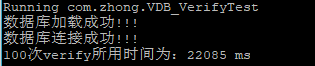

# 数据库问题

```bash
# 连接数据库
mysql -uroot -proot -P3306 -hlocalhost

source F:\睿云实验室\王剑锋\2018.7.12_VDB实验第二阶段\第3阶段\VDB4J\src\main\sql\db.sql
```

sql文件里面的内容为：

```sql
DROP DATABASE IF EXISTS vdb;

CREATE DATABASE IF NOT EXISTS vdb DEFAULT CHARSET utf8 COLLATE utf8_general_ci;

use vdb;


CREATE TABLE IF NOT EXISTS SetupOutput_H_5(
  i int not null,
  j int not null,
  H_ij blob,
  primary key(i,j)
);


CREATE TABLE IF NOT EXISTS SetupOutput_H_500(
  i int not null,
  j int not null,
  H_ij blob,
  primary key(i,j)
);


CREATE TABLE IF NOT EXISTS SetupOutput_H_6549(
  i int not null,
  j int not null,
  H_ij blob,
  primary key(i,j)
); 
```

表SetupOutput_H_5表示数组H中5行记录

表SetupOutput_H_500表示数组H中有500行记录

表SetupOutput_H_6549表示数组H中有6549行记录


当q=500时候，出现如下的问题

```bash
com.mysql.cj.jdbc.exceptions.MysqlDataTruncation: Data truncation: Data too long for column 'Hi' at row 1
```


修改sql文件里面的内容为：

```sql
DROP DATABASE IF EXISTS vdb;

CREATE DATABASE IF NOT EXISTS vdb DEFAULT CHARSET utf8 COLLATE utf8_general_ci;

use vdb;

CREATE TABLE IF NOT EXISTS SetupOutput_H(
  	i int not null,
  	j int not null,
	H_ij blob,
	primary key(i,j)
); 
```

# 正确性验证

## Setup

在命令行中运行如下的指令

```bash
# 连接数据库
mysql -uroot -proot -P3306 -hlocalhost

source F:\睿云实验室\王剑锋\2018.7.12_VDB实验第二阶段\第3阶段\VDB4J\src\main\sql\db.sql
```

运行VDB_Setup的main函数

```bash
#linux
linux: mvn exec:java -Dexec.mainClass="com.zhong.VDB_Setup" -Dexec.args="5 2"

#windows
windows: mvn exec:java -D"exec.mainClass"="com.zhong.VDB_Setup" -D"exec.args"="5 2"
```


## Update

运行VDB_Update的main函数

```bash
#linux
linux: mvn exec:java -Dexec.mainClass="com.zhong.VDB_Update" -Dexec.args=""

#windows
windows: mvn exec:java -D"exec.mainClass"="com.zhong.VDB_Update" -D"exec.args"=""
```

输出如下的内容

```bash
0
705174584455020495879460947914775963667628000543
```

其中0代表当前的T为0
705174584455020495879460947914775963667628000543为新的元素


## query

运行VDB_Query的main函数


```bash
#linux
linux: mvn exec:java -Dexec.mainClass="com.zhong.VDB_Query" -Dexec.args="0 5"

#windows
windows: mvn exec:java -D"exec.mainClass"="com.zhong.VDB_Query" -D"exec.args"="0 5"
```

输出

```bash
1653489015177421786040698304679830223482273581487786852162195848847627719619831434105629104869126167921348748107071668755058349127339040132871896113341072,3363270268778715147048417617339662786697392457799003768310570405933826800388148524732623704452494542055123103766629955275085298659327024510424429003768407,0
1
705174584455020495879460947914775963667628000543
```

最后一行输出705174584455020495879460947914775963667628000543说明查询正确

## verify


运行VDB_Verify的main函数

```bash
#linux
linux: mvn exec:java -Dexec.mainClass="com.zhong.VDB_Verify" -Dexec.args="0 5"

#windows
windows: mvn exec:java -D"exec.mainClass"="com.zhong.VDB_Verify" -D"exec.args"="0 5"
```

# 测试时间

## 输出output文件夹

因为output里面存放生成的索引，所以在进行q不相同的实验的时候需要删除旧的。


## 建立数据库

在命令行中运行如下的指令

```bash
# 连接数据库
mysql -uroot -proot -P3306 -hlocalhost
# windows下面
source F:\睿云实验室\王剑锋\2018.7.12_VDB实验第二阶段\第3阶段\VDB4J\src\main\sql\db.sql
# linux下面
source /root/VDB4J/src/main/sql/db.sql
```

## Setup

> 分为两个实验：第一个实验是q=500，为了比较c 和 java的效率（上一个VDB的实验）

运行VDB_Setup的main函数

q=500时执行下面的指令

```bash
#linux
linux: mvn exec:java -Dexec.mainClass="com.zhong.VDB_Setup" -Dexec.args="500 2"

#windows
windows: mvn exec:java -D"exec.mainClass"="com.zhong.VDB_Setup" -D"exec.args"="500 2"
```

q=6549时执行下面的指令

```bash
#linux
linux: mvn exec:java -Dexec.mainClass="com.zhong.VDB_Setup" -Dexec.args="6549 2"

#windows
windows: mvn exec:java -D"exec.mainClass"="com.zhong.VDB_Setup" -D"exec.args"="6549 2"
```


## Update


```bash
mvn test -Dtest=VDB_UpdateTest#computeUpdateTime
```


## Query


```bash
mvn test -Dtest=VDB_QueryTest#computeQueryTime_500
```

```bash
mvn test -Dtest=VDB_QueryTest#computeQueryTime_6549
```


## verify


```bash
mvn test -Dtest=VDB_VerifyTest#computerVerifyTime_6549
```


```bash
mvn test -Dtest=VDB_VerifyTest#computerVerifyTime_500
```


# 实验结果


1000次update实验

72150 ms


10次query实验


100次verify实验




# 经验总结

对于重复实验，测试时间的时候不希望读两次IO


